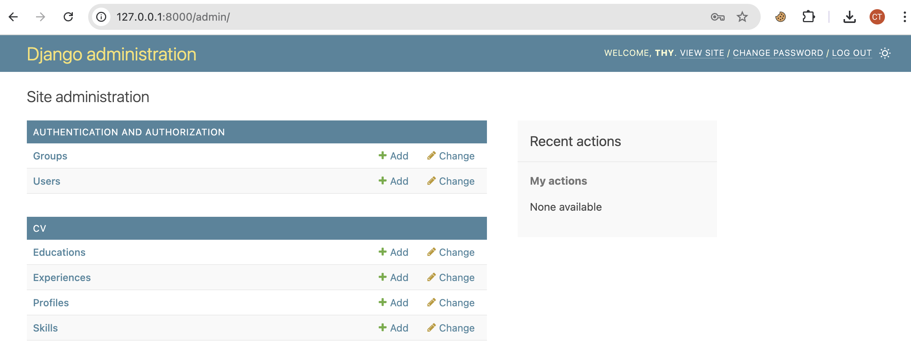
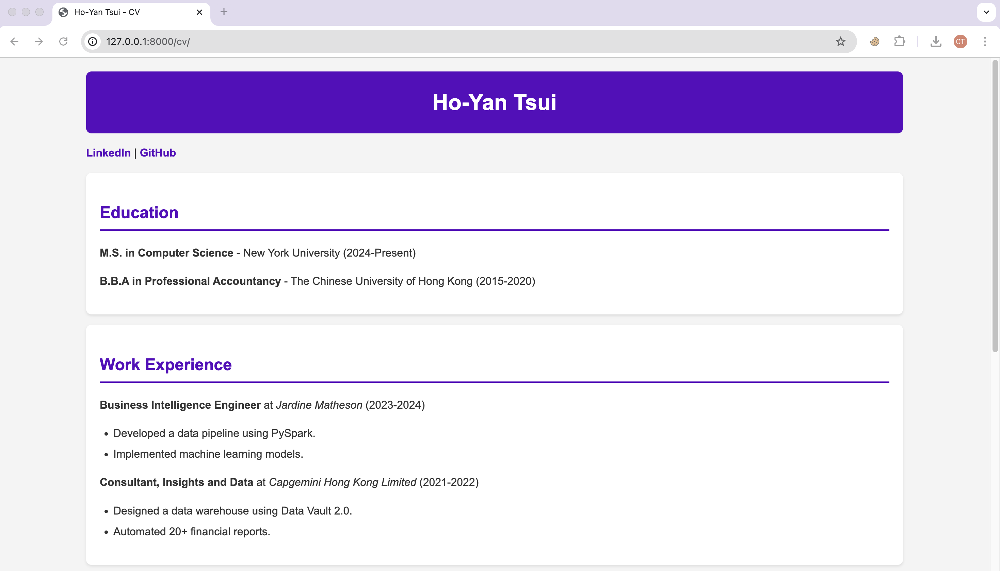
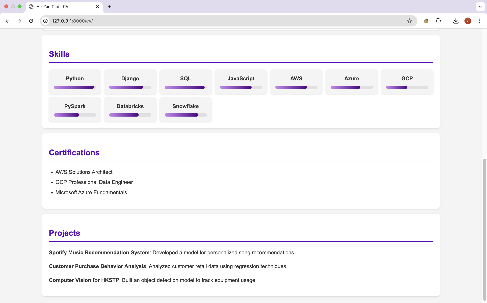

# django_cv
Steps to run the project
### 1. Clone the Repository
```bash
git clone https://github.com/yourusername/django-cv.git
cd django-cv
```

### 2. Setup Virtual Environment and Install Dependencies
```bash
python -m venv venv
source venv/bin/activate
pip install -r requirements.txt
```

### 3. Run the Django Server
```bash
python manage.py runserver
```

### 4. Open in Browser
```bash
CV Page: http://127.0.0.1:8000/cv/
```

# What I Have Done
1. Use **Django Admin Panel** to add CV details
  

2. Styled the page with **CSS + Bootstrap**
   
3. Displayed the **CV dynamically** on the `/cv/` page
  

